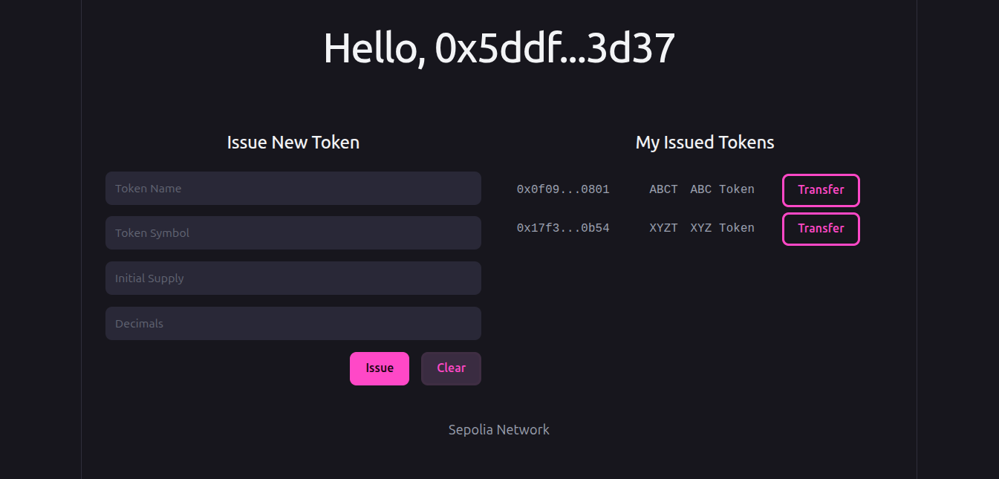
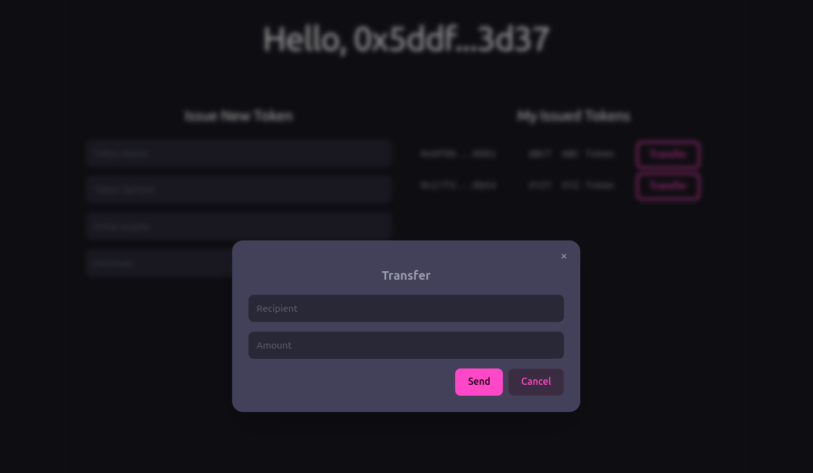

# ERC-20 Token Issuer

This dApp is my Alchemy University's Ethereum Bootcamp Week-6 Project.

There are 2 functionalities on this dApp:

- Issue a new token
- Transfer issued tokens

## Issue a New Token

## Transfer an Issued Token

